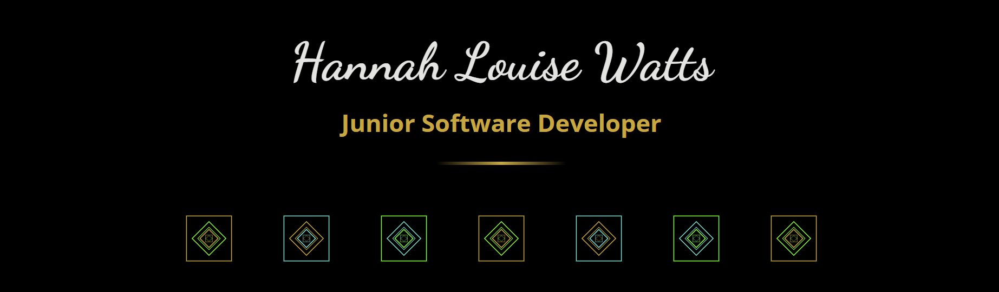

👋 Hey, I’m Hannahry aka @Hannalysis 👩‍💻💫  
🧠I’m interested in Audio, and I love Video Game Music ğŸ®ğŸ¼  
🌱 I’m currently learning 🛠ï¸ğŸ§® Data Engineering & Analysis toolkits, and Front-End design 🨠 

<!---
Hannalysis/Hannalysis is a ✨ special ✨ repository because its `README.md` (this file) appears on your GitHub profile.
You can click the Preview link to take a look at your changes.
--->
  <h1 align= "center">My Tech Stack</h1>

  

<h1></h1>

You're welcome to visit my self-designed and built portfolio site <a href ="https://www.hannalysis.co.uk">here</a> 😊

